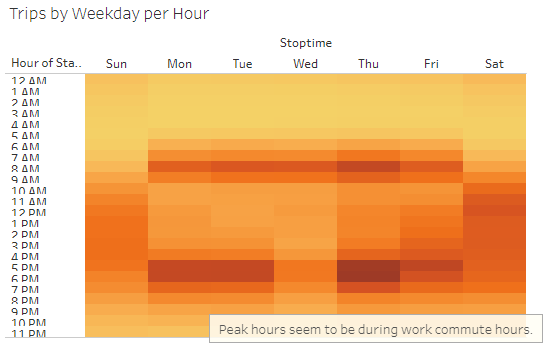

# bikesharing

# Overview of Analysis
This project is to create visualizations through Tableau to show ridership information in New York City for the Citibike bike-sharing program. The goal is to use these visualization to show investors that a similar program might work in Des Moines, Iowa. The original dataset contains information regarding trip duration, start and end times of each ride, starting and ending location, birth year and gender of the user, as well as if the user is a customer or subscriber to the service. Using this data, the following visualizations were built in Tableau:

# Results
#### Checkout Times for Users

This line graph shows the number of rides for each trip duration. Per this graph, the majority of rides are under 20 minutes, with the peak being around 5 minutes (with ~150,000 rides around the 5 minute mark).

#### Checkout Times by Gender

Similar to the previous graph, this line graph shows the number of rides for each trip duration, filtered by the customers' gender. Here we can see that the majority of Male and Female riders also ride for under 20 minutes (with the peak being around 5 minutes). While there are far fewer riders with an "Unknown" gender, the majority of these fall below the 30 minute mark, with no discernible peak.

#### Gender Breakdown

This pie chart visualizes the ratio of rider genders, with the majority of riders being Males.

#### August Peak Hours

This bar graph shows the number of rides started during each hour of the day throughout August. Thus we get a visualization of the peak hours for starting a ride. According to this graph, we can see that 8am-9am and 5pm-6pm have the highest ridership, with 12am-5am having the lowest ridership.

#### Trips by Weekday per Hours

This heatmap shows ridership per Hour per Weekday. Here we can see that around 6am-9am and 5pm-7pm have the highest ridership during weekdays (Monday-Friday), with Saturdays having similar ride counts throughout the day (9am-7pm).

#### Trips by Gender (Weekday per Hour)

Similarly, this heatmap shows the same ridership per Hour per Weekday, filtered by the customer's gender. We can see the above patterns hold true for Male and Female riders, with customers with an Unknown gender not showing a strong pattern.

#### Customer types

This pie chart shows the ratio of customer types using bikes (customers vs. subscribers). Here we can see that the majority of users are subscribers.

#### User Trips by Gender by Weekday

This heat map shows the number of trips taken by customers vs subscribers, filtered by gender. We can see that the majority of Male users are Subscribers, there are more Female subscribers than Female customers (although not as strong of a correlation as Males), and there are more Unknown Gender customers than subscribers.

# Summary

We wanted to answer the following questions through this analysis:
- What is the trip duration for bikes for all users and genders?
  - According to our graphs ("Checkout Times for Users" and "Checkout Times by Gender"), we can conclude that in NYC, the majority of riders use the bikes for under 20 minutes per ride, with the majority of rides being around 5 minutes.
- What is the bike ridership for each hour of each day of the week, for all riders and each gender?
  - According to our visualizations ("Gender Breakdown", "August Peak Hours", "Trips by Weekday per Hour", and "Trips by Gender (Weekday per Hour)"), we can see that the majority of riders are Male, with the peak ridership hours being around commute hours (7am-9am and 5pm-8pm) on Weekdays, and throughout the day (9am to 7pm) on Saturdays.
- What is the bike ridership for each type of user and gender for each day of the week?
  - According to our visualizations ("Customer Types" and "User Trips by Gender by Weekday") we can see that the majority of users are subscribers, and the majority of subscribers are Male.

I think it would be helpful to dig deeper to the customer vs. subscriber breakdown, to see what types of users are using the bike-sharing service, and if those demographics match the populations in Des Moines. Using the data we already have, we could also make the following visualizations:
- trip duration by customer type
- customer type by age
- customer type by gender
